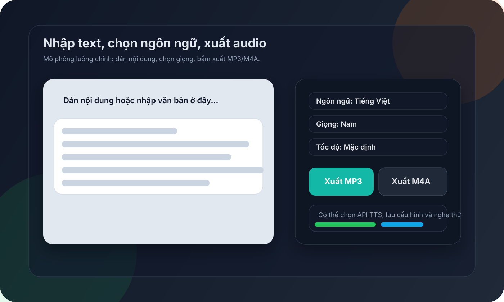
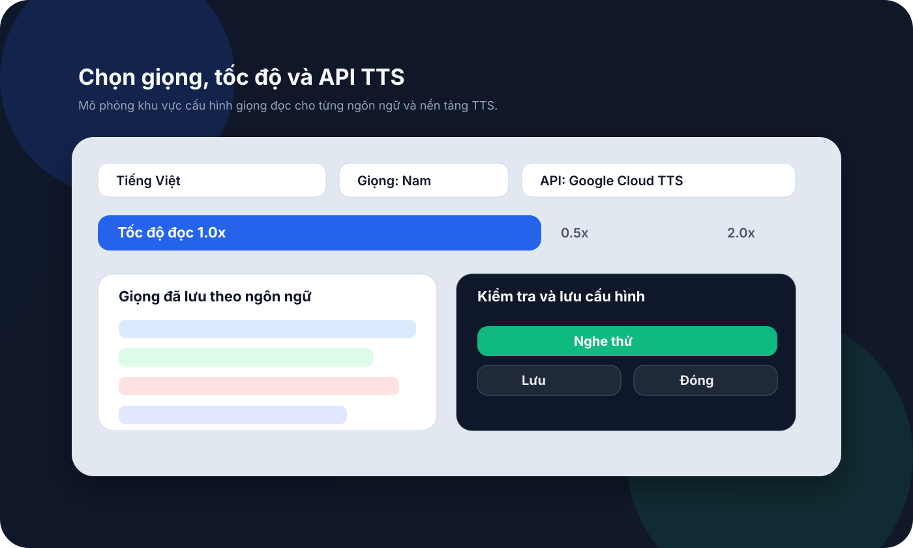
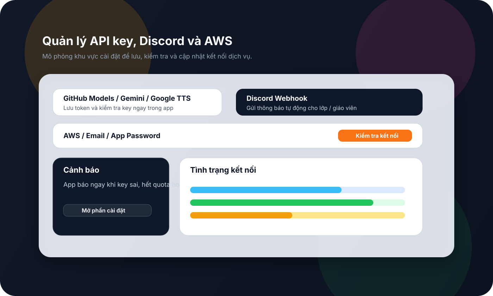

# text-to-audio-viettrungnhat

[](https://www.python.org/)
[](https://www.python.org/)
[]()

Ứng dụng text-to-speech đa ngôn ngữ dùng Python/Tkinter, tối ưu cho chạy cục bộ trên macOS và Windows.

## Tính năng chính

- Đọc text thành MP3/M4A với nhiều ngôn ngữ.
- Hỗ trợ gTTS, Google Cloud TTS, OpenAI và Gemini.
- Có khu vực quản lý API key, Discord webhook và AWS.
- Giao diện Tkinter có sẵn launcher trên macOS để mở nhanh.
- Hỗ trợ xuất âm thanh, lưu cấu hình, và chạy đúng code mới nhất trong repo.

## Mockup giao diện

### Luồng chính



### Chọn giọng và tốc độ



### API và tích hợp dịch vụ



## Mở app trên macOS

Click [TextToMp3Launcher.app](TextToMp3Launcher.app) để mở app.

Launcher này luôn trỏ về [app.pyw](app.pyw) trong thư mục dự án, nên mỗi lần bạn sửa code xong chỉ cần bấm lại icon là nó chạy bản mới nhất.

## Chạy bằng Terminal

```bash
cd /path/to/text-to-audio-viettrungnhat
./.venv312/bin/python app.pyw
```

## Cài trên máy khác

Xem hướng dẫn đầy đủ tại [docs/run-on-another-machine.md](docs/run-on-another-machine.md).
